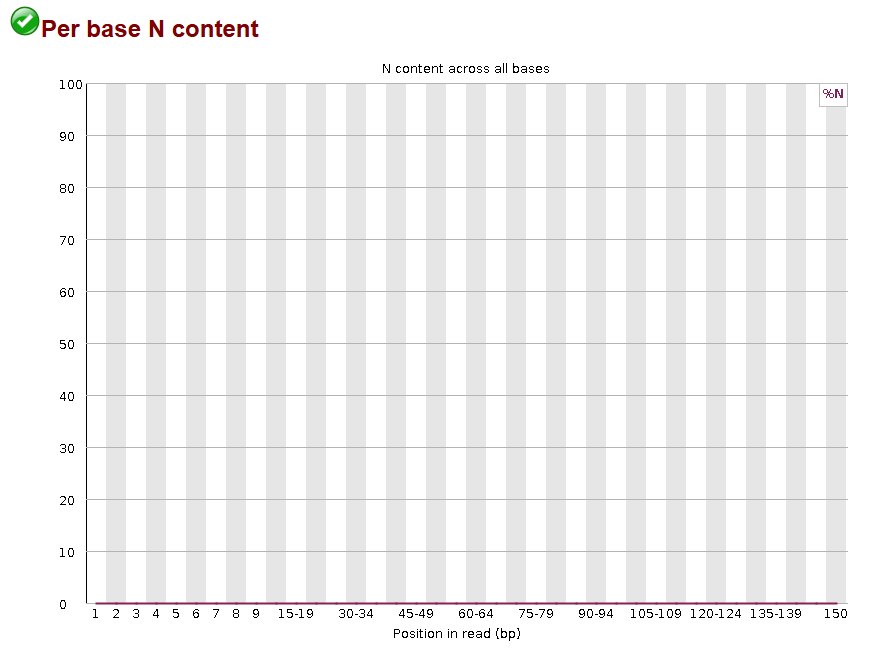

```{r global_options, include=FALSE}
knitr::opts_chunk$set(fig.pos = 'h')
```

```{r setup, include=FALSE}
knitr::opts_chunk$set(echo = TRUE)

```

# Overview: Preparing RNA-seq Reads from Electric Fish for DEG Analysis

I processed RNA-seq reads in preparation for a differential gene expression analysis of electric fish. The first RNA-seq reads sample, which is stored in NCBI's SRA database under the SRR25630310 run number, is from Campylomormyrus compressirostris, the electric fish that lives in Africa. The database information also lists that the mRNA was extracted from the electric organ of this fish and transcriptomic libraries were made as strand-specific. The second RNA-seq reads sample, which is also stored in the same database under SRR25630391 run number, is from Campylomormyrus rhynchophorus, the double trunk elephant nose fish. This fish is also an electric fish! The description says that the mRNA was extracted from either the electric organ or the skeletal muscle of this fish. This library was also strand-specific. 

The quality of the RNA-seq data was checked before continuing further work-up.  

# Part1 - Read quality score distributions: RNA Quality Check
I started by checking the per base quality across all sequences for each of the 4 files. These graphs can be seen below. For all 4 files, the high average seems to remain around ~36. The quality declines towards the end of the reads. 
```{r echo=FALSE, out.width="100%", fig.cap= "Per base sequence quality for all 4 reads of each of the four organisms. C. compressirostris corresponds to SRR25630310. C. rhynchophorus corresponds to SRR25630391. R1 corresponds to the forward read. R2 corresponds to the reverse read."}
knitr::include_graphics("PerBaseQuality.png")

```
As a confirmation that these average per base quality scores should be ~36, I ran the data through my own script as confirmation. The result below confirms this high quality average ~36. 
```{r echo=FALSE, out.width="100%"}


```

When looking at the quality across the entirety of the reads, we see a consistent high quality across the forward and the reverse reads of the C. compressirostris (SRR25630310) and the C. rhynchophorus data (SRR25630391) as seen below. 

```{r echo=FALSE, out.width="100%"}


```
All reads seem to be the same 150bp in length. All length distribution graphs for all 4 files of the C. compressirostris (SRR25630310) and the C. rhynchophorus data (SRR25630391) were all the same so for clarity I just included one of the graphs below.
```{r echo=FALSE, out.width="100%"}

```
The average quality score seems to dip towards the end of the 150 bp sequence read length. I expect that this is where the per-base N content would increase. However, the per-base N content (as seeb below) stays consistently at 0 and does not increase towards the end of the read. Again, all N Content graphs for all 4 files of the C. compressirostris (SRR25630310) and the C. rhynchophorus data (SRR25630391) were all the same so for clarity I just included one of the graphs below.
```{r echo=FALSE, out.width="100%"}


```

There were no "N" base calls across any of the reads. This speaks to the quality that the sequencer was consistently confident enough to call an A,C, G, or T at all positions across all reads. 

There was indication that trimming is still needed. For example, there seems to be adapter sequences on the end of many of the reads (~10%) from all 4 RNA sequencing files.
```{r echo=FALSE, out.width="100%"}


```
Additionally, there seems to be some barcodes left on these sequences as well. When looking at the per base sequence content (as seen below), we should expect this to be about an equal opportunity for any base pair to be called across each of our sequence reads. However, there seems to be 8-9bp that have distinct A/C/G/T calls at the beginning of each of the sequences. This is likely indicative of barcodes still remaining at the front end of these sequences. 

```{r echo=FALSE, out.width="100%"}


```

## Quality Check Conclusion
Across all 4 files: The per sequence quality scores are mostly ~36 out of 40 and there were no N base calls throughout the reads, which indicates good quality RNA-seq data. All sequences are exactly 150bp long, which is within the expectation of Illumina paired-end sequencing data. The sequence length distribution shows that all reads are 150bp long. However, we seem to have some adapters towards the end of each of the 4 reads. It seems to be the Illumina Universal Adapter and it registers upwards of 10% towards the 135bp position. These should be trimmed in order to avoid false reporting of sequences for our organism.  Illumina universal adapters are known to be 58bp long. These could be the sequences that we need to trim if these overrepresented sequences are at the ends of our reads. Looking at the per base sequence content graphs, this seem to be showing an over representation of certain bases at the first 8 base pairs of the read. This also makes me believe that Adapters are also still on the beginning of the sequence and these should be removed/trimmed.

# Part 2 Adaptor trimming Comparison
## Cutadapt

After trimming with cutadapt, there seemed to be no full adapter sequences left in any of the 4 files. This method trimmed anywhere from ~3.3% to 4.5% of reads. Additionally, part of the adapter sequence was still present towards the end of many of the reads. As you can see below in red letters, there are many reads that still held a part of that adapter sequence.

```{r echo=FALSE, out.width="100%"}


```

Trimmomatic still has the ability to trim the adapter sequences, which was the next approach.

## Adaptor Trimming and Quality Trimming (Trimmomatic)
The adapters that trimmomatic expects from Illumina Sequencing data are not the same sequences of the Illumina adapters that is used in the 4 RNA-seq data for the 2 organisms. Trimmadapt allows for including a fasta file containing the forward and reverse adapter sequences along with the other trimming "commands"(options). They were performed in the following order:
1. Trim the adapters
2. Remove base pairs from the beginning of the read if it has a low quality score (less than 3)
3. Remove the base pairs from the end of the read if it has a low quality score (less than 3)
4. From the beginning of the read, once you find a window of bases (5bp) which has a low average quality (average quality = 15), trim off those low average quality base pairs 
5. If after all of these trimming steps, the length of the read is too short (below 35) remove this read entirely

This removed the partial adapter that was previously remaining at the end of many of the reads across the 4 files!

## Trimmed Read Length Distributions
After trimming was complete, it is important to visualize the current read lengths across our data, which is shown in the two length distribution graphs below. </br>
```{r echo=FALSE, out.width="50%"}

```
```{r echo=FALSE, out.width="50%"}

```
</br>For both organisms, we still have several reads that are about 150bp in length in both the forward and reverse reads!They are so overlapping that you can barely see where they differ in the graphs above. If you'd like to look closer and find where they differ, there are slightly more 150bp length reads from read 2 of C. rhynchophorus (SRR25630391). This is great quality data that most of the data was still 150bp long after all the quality trimming performed and will be helpful in maintaining quality when aligning these reads.

# Part 3 – Alignment and strand-specificity
To align the reads to C. compressirostris, I built the database for C. compressirostris and then aligned with Star.Afterwards, I used Picard to remove duplicated reads that originated from duplicates that originate during library prep PCR amplification step and are therefore duplicated in the RNA sequencing data. With the duplicate removed, I was able to determine the number of mapped and unmapped reads from both organisms's RNA-sequencing data. 
```{r echo=FALSE}
mapped_unmapped = data.frame(Organism = c("C. compressirostris", "C. rhynchophorus"),
                             Mapped_Percent = c("85%", "93%"),
                             Mapped_Reads = c("28,658,286", "14,284,429"),
                             Unmapped_Reads = c("5,195,931", "1,022,282"))
mapped_unmapped
```
Both organisms have significantly more mapped reads than unmapped reads. 

## Determining Stranded vs. Non-stranded AND 1st vs. 2nd strand amplification
The description left on the NCBI database for these RNA sequence reads from both organisms state that they are strand-specific RNA libraries were made. The kit also says that the resulting libraries are strand-specific. Specifically it describes that there is a step that incorporates dUTP during the second strand synthesis prep and this strand is not amplified, maintaining the original DNA strand orientation. In the htseq-count article, it states that these original strand (or first strand) amplification protocols require the "Reverse" option when using htseq-count. I tested both stranded options for the htseq-count command to confirm (See Below).

```{r  echo=FALSE}
stranded = data.frame(Organism = c("C. compressirostris", "C. rhynchophorus"),
                             Reverse_Percent = c("30.0%", "34.4%"),
                             Yes_Percent = c("2.2%", "2.7%"))
stranded

```
The "Reverse_Present" describes the percentage of reads that were mapped to a feature given the expectation that the library prep was performed using the first strand amplification protocol. The "Yes_Percent" describes the percent of reads that were mapped to a feature given the library prep was performed using the second strand protocol. Given that there was a larger percent of reads mapping to a feature given the "reverse" option to htseq-count, we can confirm that this library prep was indeed performed using a first strand amplification protocol.